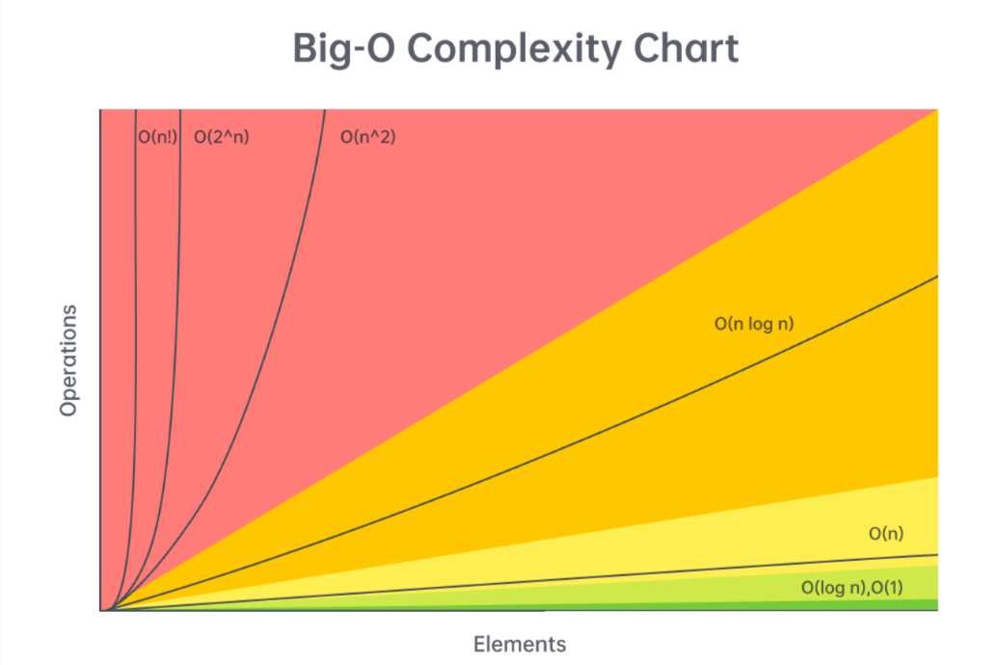

# Data Structures and Algorithm Complexity

## Big-O

## Arrays (Dynamic Array/List)

Given `n = arr.length`:

- **Add or remove element at the end:** `O(1)` amortized
- **Add or remove element from arbitrary index:** `O(n)`
- **Access or modify element at arbitrary index:** `O(1)`
- **Check if element exists:** `O(n)`
- **Two pointers:** `O(n⋅k)`, where `k` is the work done at each iteration (e.g., sliding window)
- **Building a prefix sum:** `O(n)`
- **Finding the sum of a subarray given a prefix sum:** `O(1)`

## Strings (Immutable)

Given `n = s.length`:

- **Add or remove character:** `O(n)`
- **Access element at arbitrary index:** `O(1)`
- **Concatenation between two strings:** `O(n + m)`, where `m` is the length of the other string
- **Create substring:** `O(m)`, where `m` is the length of the substring
- **Two pointers:** `O(n⋅k)`, where `k` is the work done at each iteration (e.g., sliding window)
- **Building a string from joining an array, stringbuilder, etc.:** `O(n)`

## Linked Lists

Given `n` as the number of nodes in the linked list:

- **Add or remove element given pointer before add/removal location:** `O(1)`
- **Add or remove element given pointer at add/removal location:** `O(1)` if doubly linked
- **Add or remove element at arbitrary position without pointer:** `O(n)`
- **Access element at arbitrary position without pointer:** `O(n)`
- **Check if element exists:** `O(n)`
- **Reverse between position `i` and `j`:** `O(j−i)`
- **Detect a cycle:** `O(n)` (using fast-slow pointers or hash map)

## Hash Table/Dictionary

Given `n = dic.length`:

- **Add or remove key-value pair:** `O(1)`
- **Check if key exists:** `O(1)`
- **Check if value exists:** `O(n)`
- **Access or modify value associated with key:** `O(1)`
- **Iterate over all keys, values, or both:** `O(n)`

_Note: The `O(1)` operations are constant relative to `n`, but hashing can be expensive depending on key type._

## Set

Given `n = set.length`:

- **Add or remove element:** `O(1)`
- **Check if element exists:** `O(1)`

_Same hashing note applies as with hash tables._

## Stack

If implemented with a dynamic array:

- **Push element:** `O(1)`
- **Pop element:** `O(1)`
- **Peek (see top element):** `O(1)`
- **Access or modify element at arbitrary index:** `O(1)`
- **Check if element exists:** `O(n)`

## Queue

If implemented with a doubly linked list:

- **Enqueue element:** `O(1)`
- **Dequeue element:** `O(1)`
- **Peek (see front element):** `O(1)`
- **Access or modify element at arbitrary index:** `O(n)`
- **Check if element exists:** `O(n)`

## Binary Tree Problems (DFS/BFS)

Given `n` as the number of nodes in the tree:

- **Most algorithms run in:** `O(n⋅k)`, where `k` is usually `O(1)` per node

## Binary Search Tree (BST)

Given `n` as the number of nodes:

- **Add or remove element:** `O(n)` worst case, `O(log n)` average case
- **Check if element exists:** `O(n)` worst case, `O(log n)` average case

_Average case assumes a well-balanced tree; worst case is a degenerate (linked-list-like) tree._

## Heap/Priority Queue

Given `n = heap.length` (min-heap example):

- **Add an element:** `O(log n)`
- **Delete the minimum element:** `O(log n)`
- **Find the minimum element:** `O(1)`
- **Check if element exists:** `O(n)`

## Binary Search

- **Worst case:** `O(log n)`, where `n` is the size of the search space

## Miscellaneous

- **Sorting:** `O(n log n)`
- **DFS and BFS on a graph:** `O(n⋅k + e)`, where `e` is the number of edges
- **DFS and BFS space complexity:** `O(n)`, or `O(n + e)` for graphs
- **Dynamic programming time complexity:** `O(n⋅k)`, where `k` is work per state
- **Dynamic programming space complexity:** `O(n)`, where `n` is the number of states

## Expected Time Complexity Based on `n`

| Input Size `n` | Expected Complexity |
|---------------|--------------------|
| `n <= 10` | Likely `O(2^n)` or `O(n!)` |
| `10 < n <= 20` | Likely `O(2^n)` |
| `20 < n <= 100` | Likely `O(n^3)` |
| `100 < n <= 1,000` | Likely `O(n^2)` |
| `1,000 < n <= 100,000` | Likely `O(n log n)` or `O(n)` |
| `100,000 < n <= 1,000,000` | Likely `O(n)` |
| `n > 1,000,000` | Likely `O(log n)` or `O(1)` |

## Sorting Algorithms Complexity

Most languages use `O(n log n)` sorting. Example complexities:

| Sorting Algorithm | Best | Average | Worst |
|------------------|------|---------|-------|
| QuickSort | `O(n log n)` | `O(n log n)` | `O(n^2)` |
| MergeSort | `O(n log n)` | `O(n log n)` | `O(n log n)` |
| HeapSort | `O(n log n)` | `O(n log n)` | `O(n log n)` |
| BubbleSort | `O(n)` | `O(n^2)` | `O(n^2)` |
| InsertionSort | `O(n)` | `O(n^2)` | `O(n^2)` |

_Note: Python uses Timsort (hybrid MergeSort/InsertionSort)._
